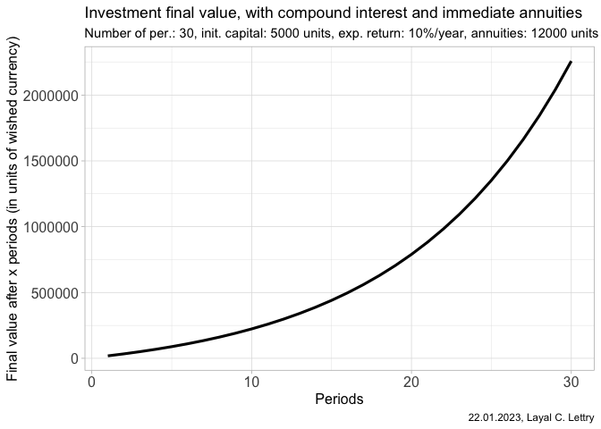

<!-- README.md is generated from README.Rmd. Please edit that file -->

# simulreturns

<!-- badges: start -->
<!-- badges: end -->

The goal of simulreturns is to give access to user-friendly tools for
computing the final value of an investment project.

## Installation

You can install the development version of simulreturns from
[GitHub](https://github.com/) with:

``` r
# install.packages("devtools")
devtools::install_github("Layalchristine24/simulreturns")
```

## Example

This is a basic example which shows you how to solve compute the final
value of an investment of 5000 units after 30 periods, with compound
interest and immediate annuities, assuming an expected return of 10% in
average and annuities of 12000 units.

``` r
library(simulreturns)
library(dplyr)
#> 
#> Attaching package: 'dplyr'
#> The following objects are masked from 'package:stats':
#> 
#>     filter, lag
#> The following objects are masked from 'package:base':
#> 
#>     intersect, setdiff, setequal, union

# Parameters
.n_per <- 30
.v_0 <- 5000
.exp_return <- 10
.compound <- TRUE
.x_yearly <- 12000
.immediate <- TRUE

# Compound return, with immediate annuities
FINAL_VALUE_CMP_IMM_ANNUITIES <- get_final_value(
  n_per = .n_per,
  v_0 = .v_0,
  exp_return = .exp_return,
  compound = .compound,
  x_yearly = .x_yearly,
  immediate = .immediate
)
FINAL_VALUE_CMP_IMM_ANNUITIES
#> # A tibble: 30 × 2
#>    period final_value
#>     <int>       <dbl>
#>  1      1      18700.
#>  2      2      33770.
#>  3      3      50347.
#>  4      4      68582.
#>  5      5      88640.
#>  6      6     110704.
#>  7      7     134974.
#>  8      8     161672.
#>  9      9     191039.
#> 10     10     223343.
#> # … with 20 more rows
```

``` r
summary(FINAL_VALUE_CMP_IMM_ANNUITIES)
#>      period       final_value     
#>  Min.   : 1.00   Min.   :  18700  
#>  1st Qu.: 8.25   1st Qu.: 169014  
#>  Median :15.50   Median : 468897  
#>  Mean   :15.50   Mean   : 694308  
#>  3rd Qu.:22.75   3rd Qu.:1066859  
#>  Max.   :30.00   Max.   :2258568
```


